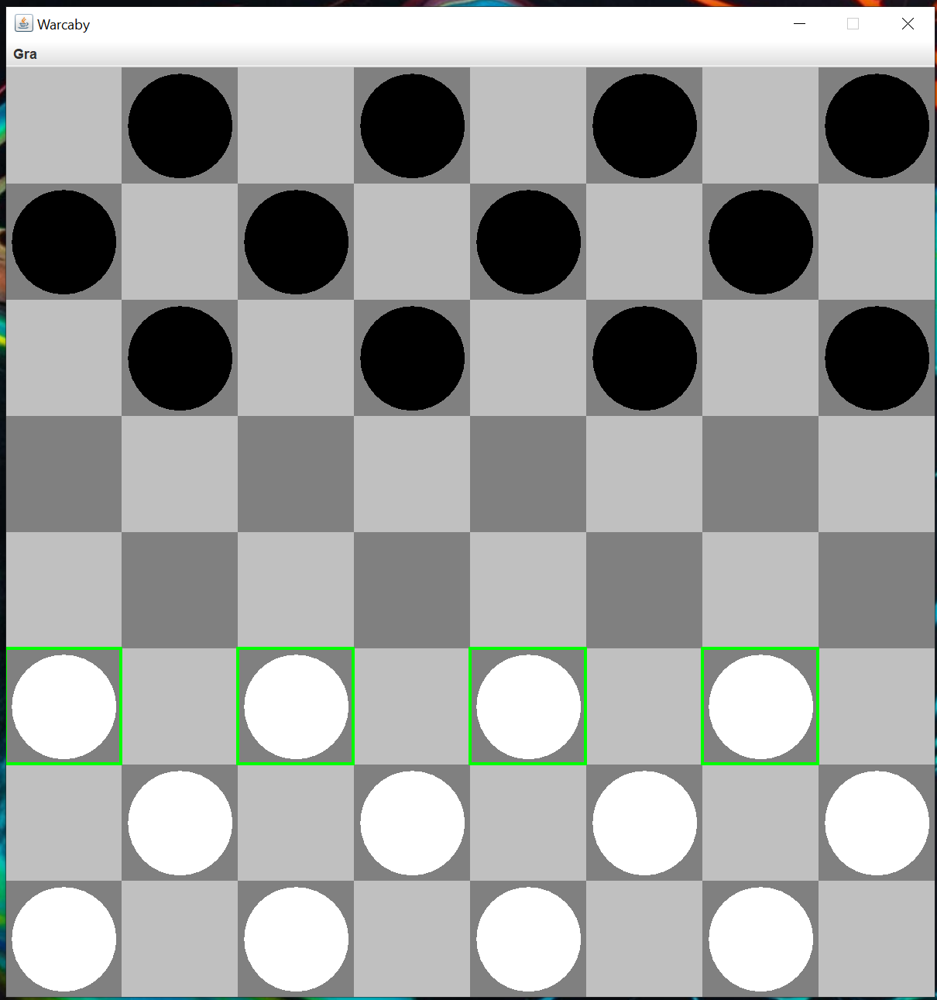
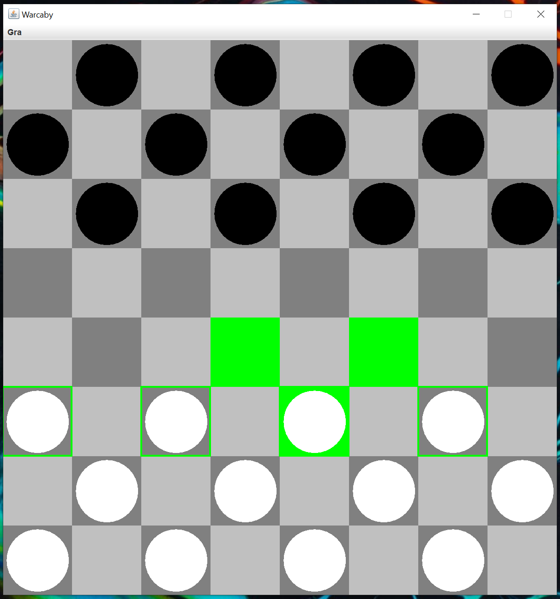
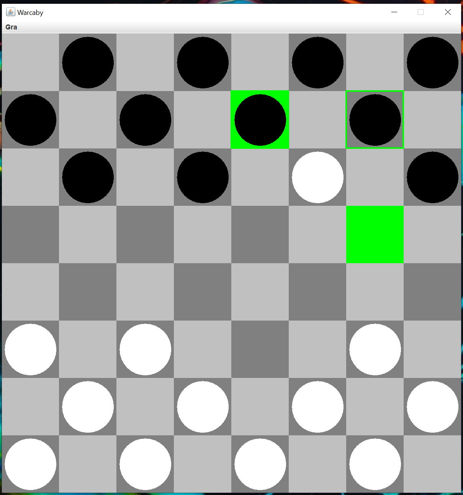
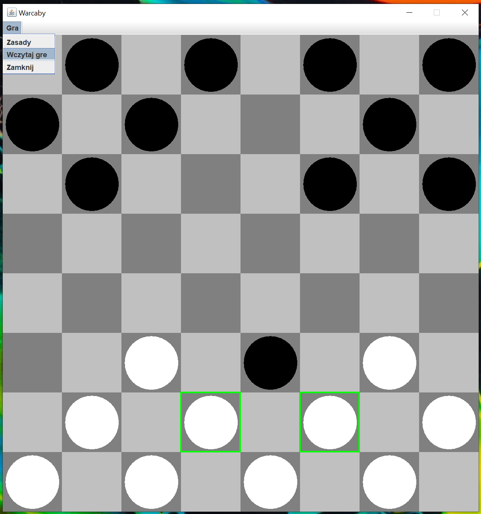
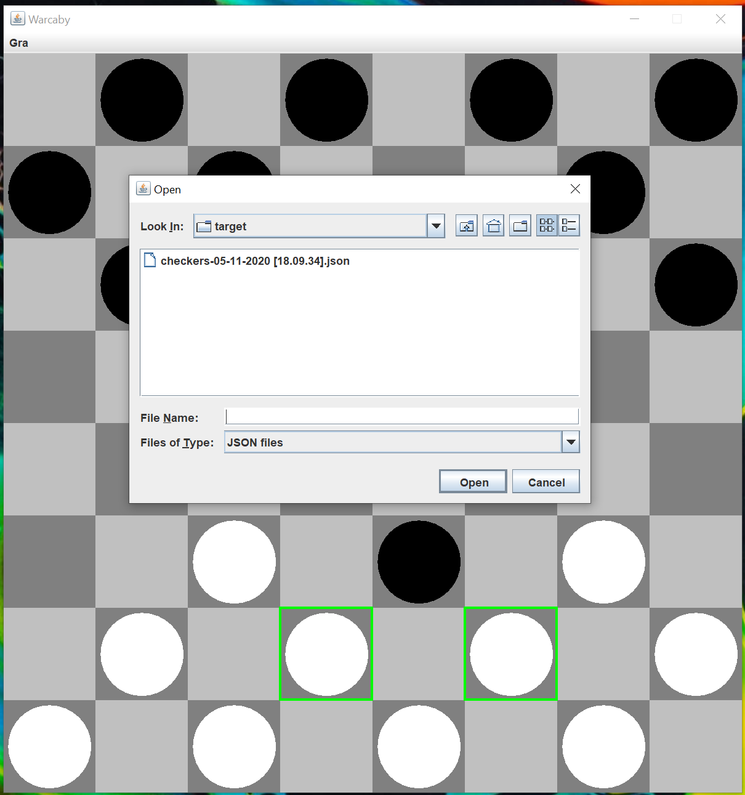
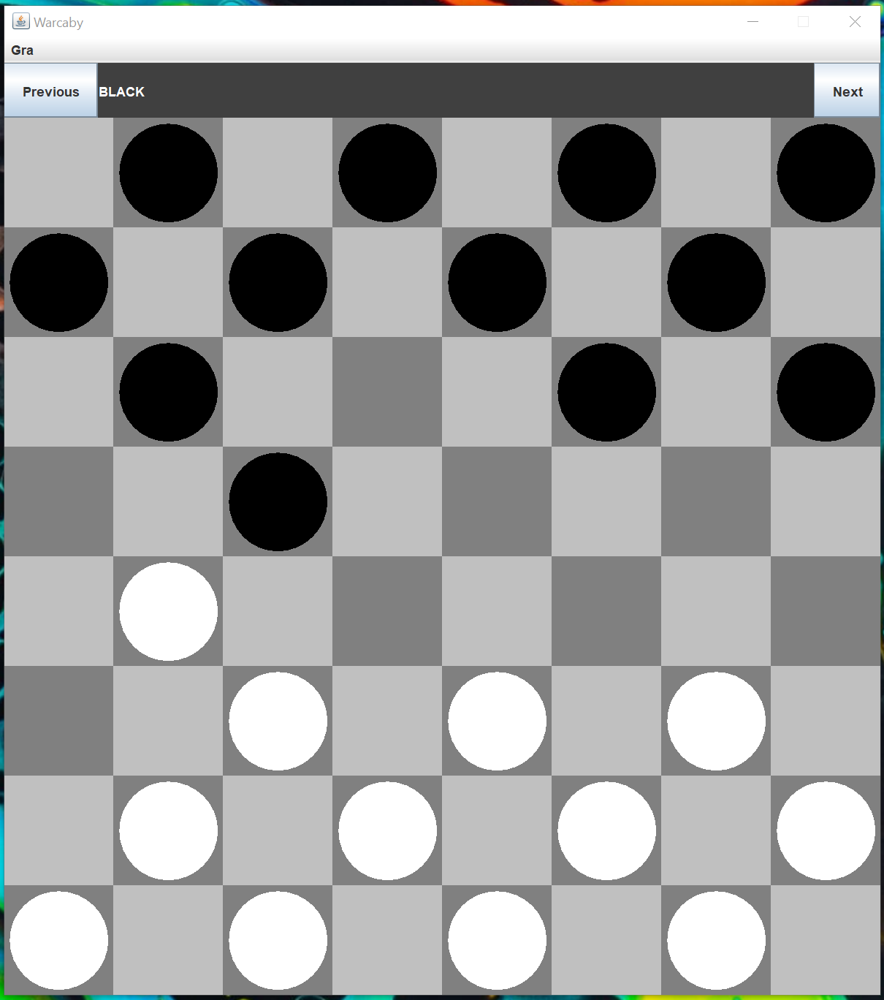

## Checkers

Checkers game written in java 11 (ui - swing) with the ability to replay the game. 
The game saves to the json file (in the same directory as the jar file) with the following name: 
<b>checkers-dd-mm-yyyy [HH::MM:SS]</b>

- dd - day
- mm - month
- yyyy - year
- HH - hour
- MM - minute
- SS - second

Require jdk 11+ with no headless environment.

### Build (maven required)
In project directory:

```mvn clean compile assembly:single```

The jar file will be placed in target directory.

### Run
```java -jar target/Checkers-1.0.0-jar-with-dependencies.jar```

### Screenshots
Available moves are marked with a green border



When you click a pawn



When you can capture, you have to do it.



Load replay



Select file with replay data



We can see bar on the top of the app with prev/next buttons and label with information whose turn it was.



